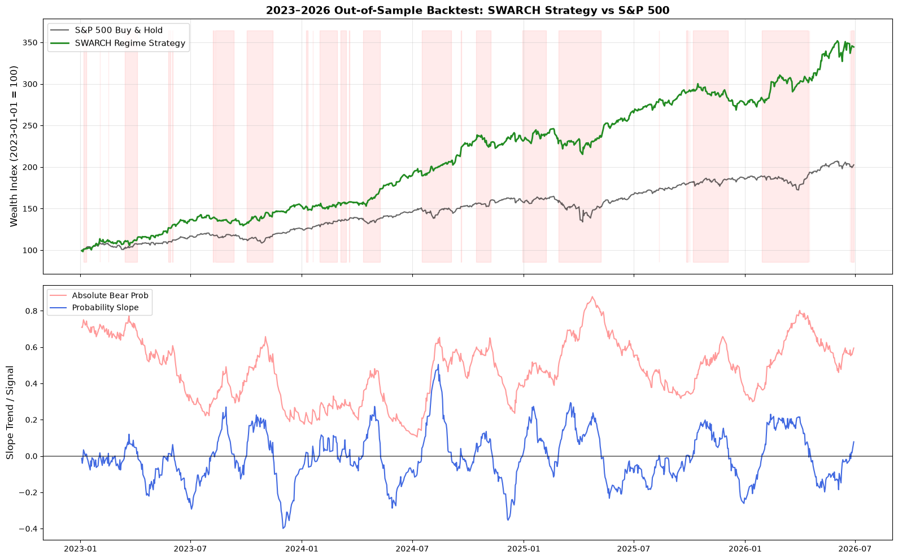

# SWARCH-TVTP Equity Regime Detection & Rotation Strategy

A two-state Hidden Markov Model combining GJR-GARCH volatility dynamics
with time-varying transition probabilities (TVTP) driven by VIX, applied
to a QQQ/XLU rotational strategy. Implemented from scratch in Python based
on Hamilton (1989), Hamilton & Susmel (1994), and Filardo (1994).

## Results Chart



## Results (Out-of-Sample: Jan 2023 – Jul 2026)

| Metric               | SWARCH-TVTP | GJR-GARCH Benchmark | S&P 500 |
| -------------------- | ----------- | ------------------- | ------- |
| Total Return         | 244.43%     | 96.54%              | 102.64% |
| Annualized Return    | 42.84%      | 21.51%              | 22.59%  |
| Sharpe Ratio (Rf=4%) | 1.84        | 0.93                | 1.08    |
| Sortino Ratio        | 2.58        | 1.22                | N/A     |
| Max Drawdown         | -12.53%     | -20.56%             | -18.76% |
| Beta vs S&P          | 0.69        | 0.63                | 1.00    |
| Information Ratio    | 1.06        | -0.06               | N/A     |

_Training data: 2010-01-01 to 2022-12-31. Test window: 2023-01-01 to 2026-06-30._

## Model Architecture

**Layer 1 — GJR-GARCH(1,1) Variance Process**  
Captures time-varying volatility with asymmetric shock response
(negative returns increase variance more than positive returns of equal size).

**Layer 2 — Two-State Hidden Markov Model (Hamilton Filter)**  
Estimates the probability of being in a low-variance (bull) or
high-variance (bear) latent state at each point in time via
sequential Bayesian updating.

**Layer 3 — VIX-Driven Time-Varying Transition Probabilities**  
Transition probabilities between states are driven by VIX through
a logistic function, making the regime-switching more sensitive
during periods of elevated market fear.

**Trading Rule**  
When the 20-day slope of the smoothed bear probability turns positive
(rising fear trend), rotate from QQQ to XLU (growth etf to value etf). Revert when slope turns
negative. Signal shifted one day forward to prevent look-ahead bias.

For full mathematical derivation, see [methodology.md](methodology.md).

## Model Variants & Design Decisions

### Asset Universe: SPY/VIX vs QQQ/VXN

Two variants of the model were trained and tested:

**Variant 1 (Primary): SPY returns + VIX as TVTP driver**  
The production model is trained on S&P 500 returns with VIX driving
transition probabilities. This design choice was deliberate: by training
on broad market dynamics rather than a single sector index, the regime
detector captures systemic volatility shifts that affect the entire
equity market — making it suitable as a **portfolio-level risk overlay**
attachable to any alpha-generating strategy, not just a QQQ/XLU rotation.

**Variant 2 (Experimental): QQQ returns + VXN as TVTP driver**  
A second variant was trained on Nasdaq-100 returns with VXN (Nasdaq
Volatility Index) as the TVTP driver. While this produced competitive
backtest metrics, it showed red flags:

- VXN is more concentrated and tech-sensitive than VIX, making the
  signal less portable to other asset classes
- A regime detector calibrated to QQQ's variance dynamics is less
  meaningful as a risk signal for a diversified portfolio

**Design conclusion:** the SPY/VIX variant is the intended production
model. The QQQ/VXN experiment confirmed that broader market calibration
produces more generalizable and robust regime signals than asset-specific
tuning, even when the trading strategy itself uses QQQ as the growth asset.

### Intended Use Case

This model is designed as a **volatility-regime overlay** attachable to
existing alpha engines, not as a standalone trading strategy. The regime
signal can be used to:

- Scale position sizes down during high-variance regimes
- Rotate a portion of portfolio exposure to defensive assets (XLU, SHY,
  TLT) when bear probability slope turns positive
- Gate alpha signals — suppressing entries during elevated-risk regimes
  where the alpha engine's edge may be diminished by market noise

The SPY/VIX calibration ensures the signal responds to **systemic market
risk** rather than sector-specific volatility, making it meaningful across
different underlying strategies.

## Development & Validation Process

The model went through four major iterations:

**v1 — Baseline SWARCH implementation**  
Built MLE from scratch (no library supports TVTP). Established
GJR-GARCH variance dynamics and Hamilton filter with random-restart
optimization to avoid local optima.

**v2 — Leakage detection & correction**  
Identified and fixed three look-ahead bias sources:

- GARCH benchmark fit on full sample including test period
- EWM warm-up computed after test truncation (lost model history)
- One-day leak in historical median threshold  
  All three corrections reduced reported performance, confirming
  they were genuine leakage rather than implementation noise.

**v3 — Regime scope analysis**  
Forward-return skill gap analysis revealed the model correctly
identifies vol-driven regimes but structurally underperforms in
macro-driven regimes (2021-2023) where VIX decouples from price
direction. Static GJR-GARCH benchmark failed identically in the
same periods, confirming this is a signal-class limitation rather
than an implementation flaw. Tested VIX z-score TVTP modification
— insufficient improvement to justify added complexity.

**v4 — Walk-forward validation**  
Confirmed out-of-sample generalization across multiple independent
test windows (2020-2021, 2023-2026) with parameters locked between
windows.

## Known Limitations and Next Steps

The model identifies **volatility-driven regime shifts** and structurally
underperforms during **macro-driven bear markets** (e.g. 2022) where
realized and implied volatility decouple from price direction. This is
a known theoretical limitation of vol-based regime detectors, not an
implementation flaw — the static GJR-GARCH benchmark fails identically
in the same periods.

Beyond that, a consistently observed limitation is the **re-entry lag**: the model exits
positions promptly when VIX rises (correctly catching the early phase of
drawdowns) but re-enters slowly because the slope-based re-entry condition
requires the smoothed bear probability to sustain a 20-day decline, by
which point the early recovery has often already occurred.

It's also important to acknowledge that the backtesting script also failed
to account for **slippage**, which may not be negligible, despite the total
number of trades across the 3.5 year testing period being somewhat low (43).

For future iterations, explore attaching **macro indicators** (yield curve slope,
credit spreads, fed funds futures) to address model weaknesses during macro-driven
bear regimes.

Also consider addressing **structural redundancies** between the symmetric
shock response ($\alpha$) and the asymmetric leverage term ($\lambda_g$). The optimizer
has been shown to set $\alpha$ to 0 because $\lambda_g$ subsumes its role for negative
shocks. With $\alpha \approx 0$, positive shocks have essentially no impact on variance,
which is empirically defensible for equity indices but represents a degenerate
parameterization.

## References

- Hamilton, J.D. (1989). A new approach to the economic analysis of
  nonstationary time series. _Econometrica_, 57(2), 357-384.
- Hamilton, J.D. & Susmel, R. (1994). Autoregressive conditional
  heteroskedasticity and changes in regime. _Journal of Econometrics_.
- Filardo, A.J. (1994). Business-cycle phases and their transitional
  dynamics. _Journal of Business & Economic Statistics_, 12(3), 299-308.

## Requirements

```
pip install -r requirements.txt
```

## Usage

```bash
# Train model (produces optimal_params)
python training/train_model.py

# Run backtest
jupyter notebook notebooks/backtesting-v3-SPY.ipynb
```
